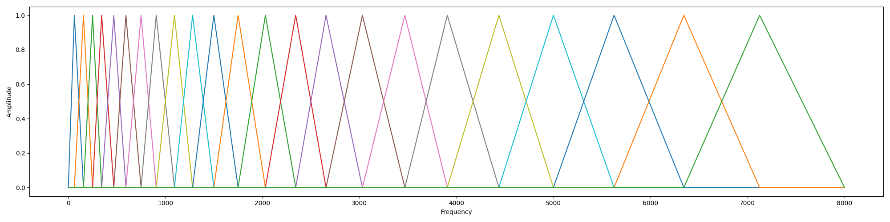
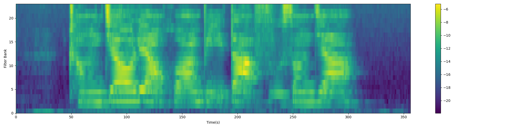
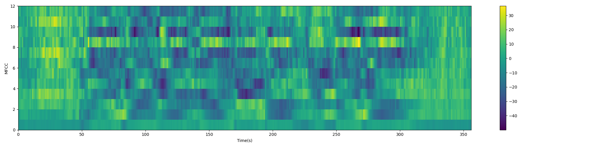

## 第二章作业

给定一段音频，请提取 12 维 MFCC 特征和 23 维 FBank。

阅读代码预加重、分帧、加窗部分，完善作业代码中 FBank 特征提取和 MFCC 特征提取部分。

### 运行

``` bash
$ pip install -r requirements.txt
$ python mfcc.py
```

### 代码说明

#### FBank

1. 根据每一帧频谱的幅值计算该帧的能量谱

``` python
def powspec(magspec, fft_len=512):
    powspec = 1.0 / fft_len * np.square(spectrum)
    return powspec
```

2. 计算采样频率对应的 Mel 滤波器组参数

Mel 刻度在低频区分辨度较高，在高频区分辨度较低，与频率之间的换算关系为：

$$
m=2595\mathrm{log}_{10}(1+\frac{f}{700})
$$

``` python
def hz2mel(hz):
    return 2595 * np.log10(1 + hz / 700.)
```

$$
f=700(10^{m/2595}-1)
$$

``` python
def mel2hz(mel):
    return 700 * (10**(mel / 2595.) - 1)
```

Mel 滤波器组就是一系列的三角形滤波器，通常有 40 个或 80 个（题目要求的维度为 23）。

在中心频率点响应值为 1，在两边的滤波器中心点衰减到 0。

$$
H_m(k)=
\left\{
\begin{aligned}
0 & , & k < f(m-1) \\
\frac{k-f(m-1)}{f(m)-f(m-1)} & , & f(m-1)\le k < f(m) \\
1 & , & k=f(m) \\
\frac{f(m+1)-k}{f(m+1)-f(m)} & , & f(m) < k \le f(m+1) \\
0 & , & k > f(m+1)
\end{aligned}
\right.
$$

``` python
def get_filterbanks(sampling_rate, num_filter=23, fft_len=512):
    low_freq = 0
    high_freq = sampling_rate / 2
    low_mel = hz2mel(low_freq)
    high_mel = hz2mel(high_freq)
    mel_points = np.linspace(low_mel, high_mel, num_filter + 2)
    hz_points = mel2hz(mel_points)
    bin = np.floor(hz_points / high_freq * (fft_len / 2))

    fbank = np.zeros((int(fft_len / 2 + 1), num_filter))
    for m in range(1, num_filter + 1):
        for k in range(int(bin[m - 1]), int(bin[m])):
            fbank[k, m - 1] = (k - bin[m - 1]) / (bin[m] - bin[m - 1])
        for k in range(int(bin[m]), int(bin[m + 1])):
            fbank[k, m - 1] = (bin[m + 1] - k) / (bin[m + 1] - bin[m])
    return fbank
```

> For a 16k sampling rate, we have a 8k Hz band.
>
> With a 512 FFT size, we divide this band into 256 bins.

实数的 DFT 具有共轭对称性，512 个实数点做完 DFT 后，只需保留一半和频率为 0 的分量。

bins 为频率窗口，也可以理解为离散频率，对 Mel 滤波器组绘图时，转回连续频率会更加直观。

``` python
fs = 16000
fft_size = 512
freq = np.linspace(0, fs / 2, fft_size / 2 + 1)
fbanks = get_filterbanks(fs, 23, fft_size)

plt.figure(figsize=(20, 5))
plt.plot(freq, fbanks)
plt.xlabel('Frequency')
plt.ylabel('Amplitude')
```



3. 在能量谱上应用 Mel 滤波器组提取 FBank 特征

$$
Y_t(m)=\sum^N_{k=1}H_m(k)|X_t(k)|^2
$$

``` python
def fbank(spectrum, num_filter=23):
    pspec = powspec(spectrum)
    fbanks = get_filterbanks(sampling_rate)
    feats = np.dot(pspec, fbanks)
    feats = np.log(np.where(feats == 0, np.finfo(float).eps, feats))
```



#### MFCC

FBank 特征是相关的，用 DCT 变换将这些相关的滤波器组系数进行压缩。

通常取 2~13 维，扔掉的信息里面包含滤波器组系数快速变化部分，这些细节信息对 ASR 可能没有帮助。

``` python
def mfcc(fbank, num_mfcc=12):
    def lifter(cepstra, L=22):
        if L > 0:
            num_mfcc = cepstra.shape[1]
            n = np.arange(num_mfcc)
            lift = 1 + (L / 2.) * np.sin(np.pi * n / L)
            return lift * cepstra
        return cepstra

    feats = np.zeros((fbank.shape[0], num_mfcc))
    feats = dct(fbank, type=2, axis=1, norm='ortho')[:, 1:(num_mfcc + 1)]
    feats = lifter(feats)
    return feats
```


